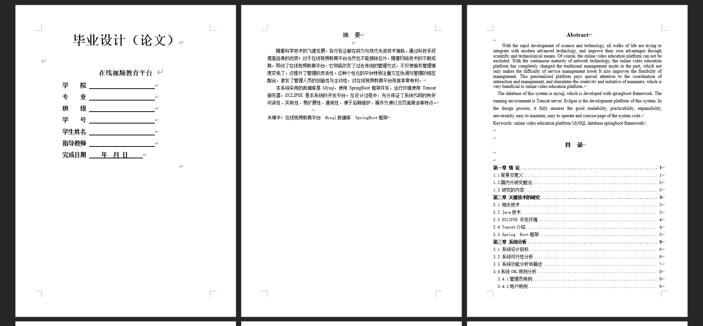

基于Springboot的在线视频教育平台"（程序+论文）
=
### 完整代码获取地址：从戎源码网 ([https://armycodes.com/](https://armycodes.com/))
### 作者微信：19941326836  QQ：952045282 
### 承接计算机毕业设计、Java毕业设计、Python毕业设计、深度学习、机器学习
### 选题+开题报告+任务书+程序定制+安装调试+论文+答辩ppt 一条龙服务
### 所有选题地址https://github.com/nature924/allProject

一、项目介绍
---
系统包含两种角色：用户、管理员，系统分为前台和后台两大模块，主要功能如下：
### 1 用户功能模块
用户登录系统后可以访问以下功能模块：

个人信息：修改账号、密码、姓名、性别、手机、邮箱、照片、备注等信息。
课程信息管理：查看课程编号、名称、类型、关键字、课时、详情、封面、教师工号、姓名、价格、审核回复、审核状态等信息。
我的收藏管理：查看和管理收藏的课程，进行详情查看、修改及删除操作。
订单管理：查看和管理订单编号、商品名称、商品图片、购买数量、价格/积分、折扣价格、总价格/总积分、支付类型、状态、地址等信息。

### 2 管理员功能模块
管理员登录系统后可以访问以下功能模块：

用户管理：查看和管理用户账号、密码、姓名、性别、手机、邮箱、照片、备注等信息。
教师管理：查看和管理教师工号、姓名、性别、照片、职称、联系电话、邮箱等信息。
课程信息管理：管理课程编号、名称、类型、关键字、课时、详情、封面、教师信息、价格、审核回复、审核状态等信息。
课程类型管理：管理课程类型信息。
我的收藏管理：管理收藏的课程。
轮播图管理：管理首页轮播图，包括新增、修改、删除操作。
订单管理：管理订单编号、商品名称、商品图片、购买数量、价格/积分、折扣价格、总价格/总积分、支付类型、状态、地址等信息。

### 3 教师功能模块
教师登录系统后可以访问以下功能模块：

课程信息管理：查看和管理课程编号、名称、类型、关键字、课时、详情、封面、教师信息、价格、审核回复、审核状态等信息。
我的收藏管理：查看和管理收藏的课程，进行详情查看、修改及删除操作。

### 4 前台首页功能模块
用户登录系统后可以访问前台首页，查看以下内容：

首页：显示系统的主要信息和功能入口。
课程信息：查看课程编号、名称、类型、关键字、课时、详情、教师信息、点击次数等信息，并进行购物车操作或收藏操作。
购物车：查看购物车中的商品信息，进行购买或删除操作。
个人中心：访问个人信息和管理功能。
后台管理：访问系统管理功能。

二、项目技术
---
- 编程语言：Java
- 数据库：MySQL
- 项目管理工具：Maven
- 前端技术：VUE、HTML、Jquery、Bootstrap
- 后端技术：Spring、SpringMVC、MyBatis

三、运行环境
---
- 操作系统：Windows、macOS都可以
- JDK版本：JDK1.8以上都可以
- 开发工具：IDEA、Ecplise、Myecplise都可以
- 数据库: MySQL5.7以上都可以
- Tomcat：任意版本都可以
- Maven：任意版本都可以

四、运行截图
---
### 论文截图：

### 程序截图：

